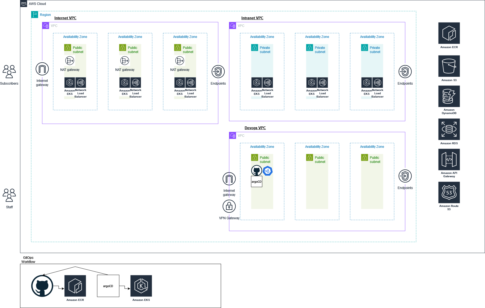

# CSIT Interview Question

This readme will serve as my diary at attempting the CSIT Interview Question for the role of Cloud Engineer  

I will structure the readme in chronological order and try to work on the problem daily  

### 7 Nov 2024
Initialised git repo  
Added qn.txt and copied interview question  
Added jd.txt 

I have never done a design question before but I will attempt to do this with whatever knowledge I have acquired over my short two years as an engineer  

My initial thoughts are  
- Fulfil all infra related requirements 
    - Demonstrate a POC for solutions used if required
- To justify why a specific solution is used for a requirement, follow the framework
    - Assess business need
        - Does the solution do what is required by the business user
    - Technical requirements
        - Performance needs and ease of integration
    - Security and compliance
        - What are the layers to prevent access
    - Cost efficiency
        - Will the company be bankrupt

### 11 Nov 2024
Came across this [resource](https://interviewing.io/guides/system-design-interview)

Okay maybe that article is too much content  

What I should do instead is apply what I know to each of the requirements  
Check my assumptions  
Explore alternatives to see if my decision changes  

#### List of requirements based on the question
1. Imagine that you are designing a cloud infrastructure to run the media information system (MIS)
    -  When I see could infra I only see AWS, as it is the cloud infra that I am most familiar with
    - Alternatives include azure and GCP
    - The users of this MIS seem to be reporters (uploaders) and subscribers (downloaders)

2. TNP is an English newspapers company which publishes and delivers daily  news contents to a wide audience of an average of 1 million print customers and 5 million online readers
    - There is existing processes to store their data for print customers, and likewise to store and serve data to their online readers

3. The contents are delivered via a variety of platforms – print hardcopy media, via browsers  on a range of devices ranging from PCs, notebooks, tablets to mobile phone apps.  
    - Frontend webapp do deliver the said data

4. The contents include news, pictures, videos, and live streams of multi-media contents for  real-life events and they must be available 24x7 and with very low latency to the subscribers 
    - This requirement suggests the use of a CDN to quickly push the content to the users
    - There is also requirement to be available 24x7, indicating the need for high availability and failovers
    - The location of the subscribers seem to be worldwide

5. An AI bot within the system will cleverly insert customized advertisements based on the  subscriber’s chosen interest areas.
    - The webpage must be designed to deploy this specific service as well

6. a) There are about three hundred reporters working for TNP and they are spread within the  country (about two third) and across the world (about one third) in the three time zones  (Asia, US and Europe)  
    - The MIS must be accessible from three timezones, this suggests the need for the application to be in multiple availability zones to reduce latency
    
    b) The reporters are the front-line eyes and the ears of the company. They glean information  from many sources including the publics, the private establishments, the government  agencies.  
       
    c) The news coverage is wide and may consists of societal events, political news, sports,  accidents, education, business, medicine, showbiz, lifestyle, technology, military, human interest stories … etc. . Therefore, the system must be available round the clock for the  reporters to upload and edit contents, pictures and videos from all types of sources. 
    - high availability

    d)  The news gathered by the reporters will be submitted to the editors who will determine  what will be published and printed.  
      
    e) The research teams in TNP will use the system to crawl the news portals across the world to  collect news-worthy information and to negotiate with the content owners to republish the  contents.    
    - some sort of frontend web scraper to search for existing content
      
    d) Some of the contents will be in the local vernacular language (eg. Bahasa Indonesia, etc.), and the TNP developers have created a AI translation engine to convert the contents into  English.   
    - translator app to translate said reused content

7.  The TNP developer team uses an industry leading CICD tool (assume Jenkins and/or Git) to  build, test, package and deploy the containerized applications.
    - Git is my preferred SCM
    - Gitlab / github actions is my preferred CI solution
    - GitOps is my preferred CD solution (ArgoCD)
    - For deployment of containerized applications, I will prefer kubernetes, from cloud perspective I will suggest EKS Fargate from AWS

8. The media information system is the heart of the entire organization and it is also the data  lake that store massive amount of structured and unstructured data which are the lifeline of  the organization. The system is regarded as mission critical and its availability and security is  of utmost importance to the organization 
    - Structured data - AWS RDS
    - Unstructured data - AWS s3, aws dynamodb

Task 1:   
  
i. Please design a manageable, secure, scalable, high performance, efficient, elastic, highly  available, fault tolerant and recoverable architecture that allows the company to grow.  
You may apply the cloud technologies from AWS, MS Azure, GCP or VMWare for your design.  Please assume that your audience is not super familiar with the cloud technologies and the  terminologies.  
    - AWS is my choice of cloud provider  

ii. Describe the various architecture components that are involved and the challenges that are  expected, and the various ways to overcome these challenges. State all your assumptions  clearly. 
    - Some tools are used 

### 12 Nov 2024

Added draw.io diagram

I just drew what I knew and understand can work, based on my previous experience

### 13 Nov 2024  

Describe the various architecture components that are involved and the challenges that are expected, and the various ways to overcome these challenges.

Summary of Architecture components

| S/N | Category                     | Components                                               | Purpose / Function                                                   | Potential Challenges                      | Potential Solutions                      | Comments|
|-----|------------------------------|----------------------------------------------------------|-----------------------------------------------------------------------|-------------------------------------------|------------------------------------------|-|
| 1   | **Cloud Platform**           | AWS                                                      | Main platform for deploying the MIS                                  | Vendor lock-in                            |  Use multi-cloud strategy or abstraction layers (e.g., Terraform) to reduce dependency on a single provider | Cloud agnostic solution is viable but will be difficult to maintain if for e.g. terraform scripts syntax differs across cloud providers
| 2   | **Scalability & Elasticity** | Elastic Load Balancer (ELB), KEDA                        | Distributes traffic and enables auto-scaling                         |  Scaling complex microservices efficiently |  Set up scaling policies and use KEDA for event-based scaling within Kubernetes |
| 3   | **High Availability & Fault Tolerance** | Multi-AZ Setup, EKS                   | Provides redundancy and ensures continuous availability              |  Cross-AZ latency or network failure       |  Deploy resources across multiple AZs with automated failover configurations |
| 4   | **Low Latency & Global Delivery** | Amazon CloudFront, AWS Global Accelerator | Caches and accelerates content delivery globally                     |  Latency for regions without edge locations |  Use AWS Global Accelerator to optimize routing and place caching servers closer to users | I have not used AWS Global Accelerator before
| 5   | **Security & Compliance**    | AWS IAM, AWS KMS                                         | Manages access, security, and encryption                             |  Managing permissions and secure key storage |  Define least-privilege IAM policies, enforce multi-factor authentication, and use KMS for key rotation | 
| 6   | **Data Lake & Analytics**    | Amazon S3, Amazon RDS, Amazon DynamoDB                   | Stores structured and unstructured data                              |  Cost management and data retrieval times  |  Use data lifecycle policies for S3, use reserved instances for RDS, and DynamoDB's on-demand scaling |
| 7   | **CI/CD**                    | Git, AWS Elastic Container Registry (ECR), ArgoCD, GitHub Actions/GitLab CI | Manages source code, image storage, and deployment pipelines |  Versioning and ensuring smooth deployment |  Use branch-based deployment workflows, automated testing, and GitOps with ArgoCD for Kubernetes |Ideally the code is able to be built once and deployed everywhere (BODE) across environments
| 8   | **Cost Optimization**        | AWS Cost Explorer                                        | Monitors and optimizes cloud spending                                |  Unexpected cost increases                 |  Set budget alerts, review Cost Explorer reports, and right-size instances based on usage patterns | I have not used AWS Cost explorer before
| 9   | **Monitoring & Logging**     | Amazon CloudWatch, Prometheus, Grafana                   | Tracks metrics, application performance, and visualizes data         |  Maintaining visibility across distributed systems |  Set up alerts in CloudWatch and configure Grafana dashboards for Prometheus data |I have not used Grafana and Prometheus
||

Example workflow for developers can be:
1. Push code into Source Code Management tool, 
2. Their code will be built via github actions, aka an agent will clone the repository and run the dockerfile to build the image 
3. The image will then be pushed into ECR
4. An automation script can be used to modify the kubernetes manifest files (yaml) to update the version of the image being pulled from the ECR to the latest
5. ArgoCD will poll the SCM repository and detect the change in the version and deploy the latest kubernetes manifest yaml file 

Example workflow for reporters:
1. Login to MIS frontend UI
2. Run required service
    - Upload content (assuming code is built and network is set up to read and update s3 bucket/databases)
    - Run webscraper (assuming code is built and deployed on k8s cluster)
    - Run translator (assuming code is built and deployed on k8s cluster) 

