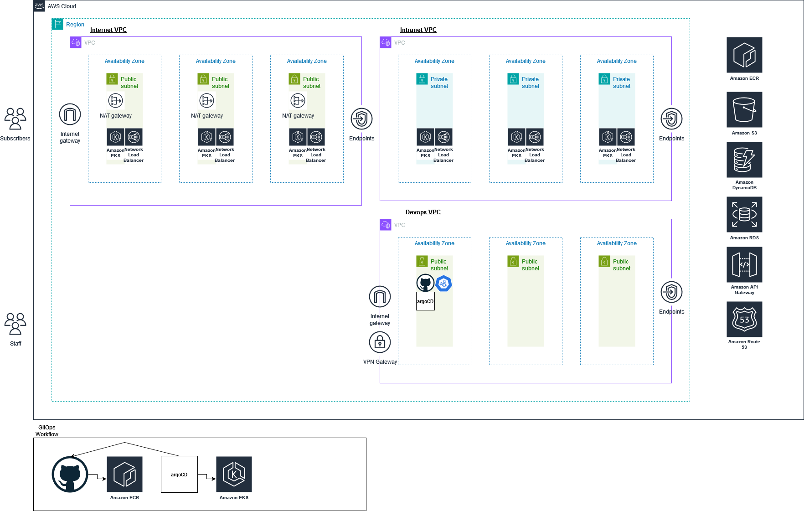

## Brief 1
Task 1:  

i. Please design a manageable, secure, scalable, high performance, efficient, elastic, highly  available, fault tolerant and recoverable architecture that allows the company to grow.  
You may apply the cloud technologies from AWS, MS Azure, GCP or VMWare for your design.  Please assume that your audience is not super familiar with the cloud technologies and the  terminologies. 
### Architecture diagram



ii. Describe the various architecture components that are involved and the challenges that are  expected, and the various ways to overcome these challenges. State all your assumptions  clearly. 
### Summary of Architecture components

| S/N | Category                     | Components                                               | Purpose / Function                                                   | Potential Challenges                      | Potential Solutions                      | Comments|
|-----|------------------------------|----------------------------------------------------------|-----------------------------------------------------------------------|-------------------------------------------|------------------------------------------|-|
| 1   | **Cloud Platform**           | AWS                                                      | Main platform for deploying the MIS                                  | Vendor lock-in                            |  Use multi-cloud strategy or abstraction layers (e.g., Terraform) to reduce dependency on a single provider | Cloud agnostic solution is viable but will be difficult to maintain if for e.g. terraform scripts syntax differs across cloud providers
| 2   | **Scalability & Elasticity** | Elastic Load Balancer (ELB), KEDA                        | Distributes traffic and enables auto-scaling                         |  Scaling complex microservices efficiently |  Set up scaling policies and use KEDA for event-based scaling within Kubernetes |
| 3   | **High Availability & Fault Tolerance** | Multi-AZ Setup, EKS                   | Provides redundancy and ensures continuous availability              |  Cross-AZ latency or network failure       |  Deploy resources across multiple AZs with automated failover configurations |
| 4   | **Low Latency & Global Delivery** | Amazon CloudFront, AWS Global Accelerator | Caches and accelerates content delivery globally                     |  Latency for regions without edge locations |  Use AWS Global Accelerator to optimize routing and place caching servers closer to users | I have not used AWS Global Accelerator before
| 5   | **Security & Compliance**    | AWS IAM, AWS KMS                                         | Manages access, security, and encryption                             |  Managing permissions and secure key storage |  Define least-privilege IAM policies, enforce multi-factor authentication, and use KMS for key rotation | 
| 6   | **Data Lake & Analytics**    | Amazon S3, Amazon RDS, Amazon DynamoDB                   | Stores structured and unstructured data                              |  Cost management and data retrieval times  |  Use data lifecycle policies for S3, use reserved instances for RDS, and DynamoDB's on-demand scaling |
| 7   | **CI/CD**                    | Git, AWS Elastic Container Registry (ECR), ArgoCD, GitHub Actions/GitLab CI | Manages source code, image storage, and deployment pipelines |  Versioning and ensuring smooth deployment |  Use branch-based deployment workflows, automated testing, and GitOps with ArgoCD for Kubernetes |Ideally the code is able to be built once and deployed everywhere (BODE) across environments
| 8   | **Cost Optimization**        | AWS Cost Explorer                                        | Monitors and optimizes cloud spending                                |  Unexpected cost increases                 |  Set budget alerts, review Cost Explorer reports, and right-size instances based on usage patterns | I have not used AWS Cost explorer before
| 9   | **Monitoring & Logging**     | Amazon CloudWatch, Prometheus, Grafana                   | Tracks metrics, application performance, and visualizes data         |  Maintaining visibility across distributed systems |  Set up alerts in CloudWatch and configure Grafana dashboards for Prometheus data |I have not used Grafana and Prometheus
||

Example workflow for developers can be:
1. Push code into Source Code Management tool, 
2. Their code will be built via github actions, aka an agent will clone the repository and run the dockerfile to build the image 
3. The image will then be pushed into ECR
4. An automation script can be used to modify the kubernetes manifest files (yaml) to update the version of the image being pulled from the ECR to the latest
5. ArgoCD will poll the SCM repository and detect the change in the version and deploy the latest kubernetes manifest yaml file 

Example workflow for reporters:
1. Login to MIS frontend UI
2. Run required service
    - Upload content (assuming code is built and network is set up to read and update s3 bucket/databases)
    - Run webscraper (assuming code is built and deployed on k8s cluster)
    - Run translator (assuming code is built and deployed on k8s cluster) 


## Brief 2  
TNP’s media information system has been operational for the past six months. Recently, many users  are complaining that a web application which used to respond in sub-second, is responding very  slowly these days. Some users see many 4XX errors while some users see 5xx errors. We do not  know if the problem is with the client browser end, the webapp process itself, the Linux node,  networking, or etc.  

Task 2:  

i. List how you go about to check and troubleshoot the problems. You may suggest commands  and tools to use during the resolution process. You may list the metrics which you use and  why you use them.  

ii. Please describe how you analyze the situation, use the metrics, and derive the  recommended steps. Do state the assumptions you made regarding the scenarios  

4XX errors are related to client side


```
Invoke-WebRequest -Uri "http://www.google.com/404" -Method GET
Invoke-WebRequest:

  Error 404 (Not Found)!!1

    *{margin:0;padding:0}html,code{font:15px/22px arial,sans-serif}html{background:#fff;color:#222;padding:15px}body{margin:7% auto 0;max-width:390px;min-height:180px;padding:30px 0 15px}* > body{background:url(//www.google.com/images/errors/robot.png) 100% 5px no-repeat;padding-right:205px}p{margin:11px 0 22px;overflow:hidden}ins{color:#777;text-decoration:none}a img{border:0}@media screen and (max-width:772px){body{background:none;margin-top:0;max-width:none;padding-right:0}}#logo{background:url(//www.google.com/images/branding/googlelogo/1x/googlelogo_color_150x54dp.png) no-repeat;margin-left:-5px}@media only screen and (min-resolution:192dpi){#logo{background:url(//www.google.com/images/branding/googlelogo/2x/googlelogo_color_150x54dp.png) no-repeat 0% 0%/100% 100%;-moz-border-image:url(//www.google.com/images/branding/googlelogo/2x/googlelogo_color_150x54dp.png) 0}}@media only screen and (-webkit-min-device-pixel-ratio:2){#logo{background:url(//www.google.com/images/branding/googlelogo/2x/googlelogo_color_150x54dp.png) no-repeat;-webkit-background-size:100% 100%}}#logo{display:inline-block;height:54px;width:150px}


  404. That’s an error.
  The requested URL /404 was not found on this server.  That’s all we know.
```
```
Invoke-WebRequest -Uri "http://example.com/somepage" -Method POST
Invoke-WebRequest: Response status code does not indicate success: 405 (Method Not Allowed).
```

For 4xx errors I will test the connection from multiple clients to confirm that the service is down  


5XX errors are usually server side

1. I will check if the service is up 
2. Try to establish a direct connection without any network hops inbetween  
3. Identify the full network flow  
4. For example  
    - Client > VPN server > AWS Route 53 server > Load Balancer IP > EKS Service IP > Pod IP  
    - I will spin up an EC2 in the same subnet as the EKS cluster and run a curl command to fire a http request to the Pod directly  
    - If that is fine then I will move down the chain to identify which client/server is causing the main 5xx error
